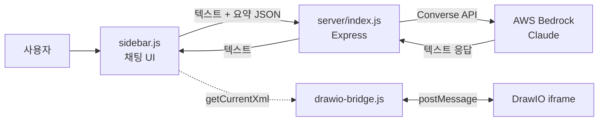
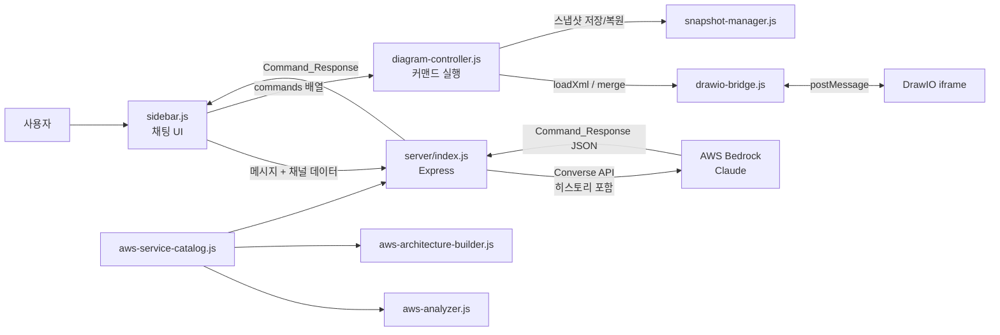
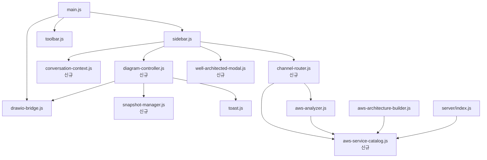

# 설계 문서: AI 아키텍처 에이전트 고도화

## 개요

DaVinci AI Agent를 텍스트 전용 조언 시스템에서 다이어그램을 직접 조작할 수 있는 프로덕션 등급 아키텍처 어시스턴트로 고도화한다. 핵심 변경 사항은 다음과 같다:

1. **Diagram Controller 모듈 신규 생성** — AI Agent의 구조화된 커맨드를 해석하여 DrawIO Bridge를 통해 다이어그램을 조작
2. **통신 채널 분리** — XML 원본 채널과 요약 분석 채널을 분리하여 상황별 최적 데이터 전달
3. **구조화된 응답 체계** — AI Agent가 텍스트 + 실행 가능한 커맨드를 JSON으로 반환
4. **대화 히스토리 관리** — Bedrock Converse API의 messages 배열을 활용한 맥락 유지
5. **스냅샷 기반 Undo** — 커맨드 실행 전 자동 스냅샷 저장 및 복원
6. **Well-Architected 평가** — 5개 Pillar 기준 점수화 및 개선 권장사항 자동 적용
7. **서비스 카탈로그 통합** — 중복된 서비스 분류 로직을 단일 모듈로 통합
8. **시스템 프롬프트 고도화** — 커맨드 스키마, 서비스 목록, 모범사례를 프롬프트에 포함

## 아키텍처

### 현재 아키텍처



### 목표 아키텍처



### 모듈 의존성



## 컴포넌트 및 인터페이스

### 1. aws-service-catalog.js (신규 — src/core/aws-service-catalog.js)

서비스 분류 로직을 통합하는 단일 소스 모듈.

```javascript
/**
 * AWS 서비스 카탈로그 엔트리
 * @typedef {Object} ServiceEntry
 * @property {string} type - 서비스 타입 식별자 (예: 'ec2', 'lambda')
 * @property {string} category - 카테고리 (예: 'Compute', 'Database')
 * @property {string} tier - 아키텍처 계층 (예: 'web', 'db', 'edge')
 * @property {RegExp} stylePattern - DrawIO 스타일 매칭 패턴
 * @property {string} label - 기본 표시 라벨
 */

// 주요 내보내기 함수
export function getCategoryByType(type) → string
export function identifyServiceByStyle(style) → ServiceEntry | null
export function getLabelByType(type) → string
export function getAllServicesAsJSON() → object[]
export function getServicesByCategory(category) → ServiceEntry[]
```

### 2. diagram-controller.js (신규 — src/core/diagram-controller.js)

AI Agent 커맨드를 해석하여 DrawIO Bridge를 통해 다이어그램을 조작.

```javascript
/**
 * @typedef {Object} DiagramCommand
 * @property {'add_service'|'remove_service'|'add_connection'|'remove_connection'|'replace_all'} type
 * @property {Object} params - 커맨드별 파라미터
 */

export class DiagramController {
    constructor(bridge, snapshotManager)
    
    /**
     * 커맨드 배열을 순차 실행한다.
     * 실행 전 스냅샷을 자동 저장하고, 오류 시 롤백한다.
     * @param {DiagramCommand[]} commands
     * @returns {Promise<{success: boolean, message: string}>}
     */
    async executeCommands(commands)
    
    // 개별 커맨드 핸들러 (내부)
    async _addService(params)      // mxCell XML 생성 → bridge.merge()
    async _removeService(params)   // XML에서 대상 mxCell 제거 → bridge.loadXml()
    async _addConnection(params)   // Edge mxCell XML 생성 → bridge.merge()
    async _removeConnection(params)// XML에서 대상 Edge 제거 → bridge.loadXml()
    async _replaceAll(params)      // bridge.loadXml(params.xml)
}
```

### 3. snapshot-manager.js (신규 — src/core/snapshot-manager.js)

다이어그램 스냅샷 저장 및 복원 관리.

```javascript
/**
 * @typedef {Object} ArchitectureSnapshot
 * @property {string} xml - 다이어그램 XML
 * @property {number} timestamp - 생성 시각 (Date.now())
 * @property {string} description - 트리거한 커맨드 설명
 */

export class SnapshotManager {
    constructor(maxSnapshots = 20)
    
    save(xml, description) → ArchitectureSnapshot
    restore() → ArchitectureSnapshot | null  // 가장 최근 스냅샷 반환 및 제거
    getHistory() → ArchitectureSnapshot[]
    clear()
}
```

### 4. conversation-context.js (신규 — src/core/conversation-context.js)

대화 히스토리 관리 및 토큰 제한 처리.

```javascript
/**
 * @typedef {Object} ConversationMessage
 * @property {'user'|'assistant'} role
 * @property {string} content
 */

export class ConversationContext {
    constructor(maxTokenRatio = 0.8)
    
    addMessage(role, content)
    getMessages() → ConversationMessage[]
    reset()
    estimateTokens() → number
    trimToFit(maxTokens)
}
```

### 5. channel-router.js (신규 — src/core/channel-router.js)

사용자 요청 유형에 따라 Summary/XML 채널을 선택하고 데이터를 준비.

```javascript
/**
 * @typedef {'summary'|'xml'} ChannelType
 */

export class ChannelRouter {
    constructor(bridge)
    
    /**
     * 메시지 의도를 분석하여 적절한 채널과 데이터를 반환한다.
     * 수정/생성 키워드 → XML 채널, 그 외 → Summary 채널
     */
    async preparePayload(userMessage) → { channel: ChannelType, data: object }
}
```

### 6. server/index.js (수정)

구조화된 응답 체계와 대화 히스토리를 지원하도록 API 엔드포인트 수정.

```javascript
// POST /api/chat 수정
// 요청 body: { message, architecture, channel, conversationHistory }
// 응답 body: { message, commands }  (Command_Response 형식)

// 시스템 프롬프트에 포함할 내용:
// - Command_Response JSON 스키마
// - 사용 가능한 커맨드 타입 및 파라미터
// - AWS 서비스 카탈로그 (aws-service-catalog에서 import)
// - AWS 모범사례 가이드라인
// - 현재 아키텍처 상태 (채널에 따라 요약 또는 XML)
```

### 7. sidebar.js (수정)

채널 라우팅, 대화 히스토리, Command_Response 처리, Well-Architected 평가 UI 통합.

```javascript
// 주요 변경사항:
// - ChannelRouter를 사용하여 요청 데이터 준비
// - ConversationContext로 대화 히스토리 관리
// - Command_Response 파싱 → DiagramController.executeCommands() 호출
// - "새 대화" 버튼 추가
// - "되돌리기" 버튼 추가
// - Well-Architected 평가 결과 모달 표시
```

### 8. well-architected-modal.js (신규 — src/components/well-architected-modal.js)

Well-Architected 평가 결과를 Pillar별 점수 차트와 상세 설명으로 표시하는 모달.

```javascript
/**
 * @typedef {Object} PillarScore
 * @property {string} pillar - Pillar 이름
 * @property {number} score - 1~5점
 * @property {string} rationale - 근거 설명
 * @property {Array<{text: string, command: DiagramCommand[]}>} recommendations - 개선 권장사항
 */

export function showWellArchitectedModal(scores, onApplyRecommendation)
```

## 데이터 모델

### Command_Response (AI Agent 응답 형식)

```json
{
  "message": "string — AI의 텍스트 응답 (분석 결과, 수정 사유 등)",
  "commands": [
    {
      "type": "add_service | remove_service | add_connection | remove_connection | replace_all",
      "params": { }
    }
  ]
}
```

### 커맨드별 params 스키마

**add_service:**
```json
{
  "serviceType": "ec2",
  "label": "Web Server",
  "x": 400,
  "y": 300,
  "style": "선택적 — 미지정 시 카탈로그 기본 스타일 사용"
}
```

**remove_service:**
```json
{
  "serviceId": "mxCell id 또는 라벨로 식별",
  "label": "대상 서비스 라벨 (id 미지정 시 라벨로 검색)"
}
```

**add_connection:**
```json
{
  "sourceLabel": "소스 서비스 라벨",
  "targetLabel": "타겟 서비스 라벨",
  "label": "연결 라벨 (선택적)"
}
```

**remove_connection:**
```json
{
  "sourceLabel": "소스 서비스 라벨",
  "targetLabel": "타겟 서비스 라벨"
}
```

**replace_all:**
```json
{
  "xml": "전체 mxGraphModel XML 문자열"
}
```

### Architecture_Snapshot

```json
{
  "xml": "string — 다이어그램 XML 전체",
  "timestamp": 1719000000000,
  "description": "string — 트리거한 커맨드 설명 (예: 'add_service: Lambda 추가')"
}
```

### Conversation_Context 메시지

```json
{
  "role": "user | assistant",
  "content": "string — 메시지 내용"
}
```

### Well-Architected 평가 결과

```json
{
  "message": "전체 평가 요약",
  "wellArchitected": {
    "pillars": [
      {
        "pillar": "운영 우수성 | 보안 | 안정성 | 성능 효율성 | 비용 최적화",
        "score": 3,
        "rationale": "근거 설명",
        "recommendations": [
          {
            "text": "개선 권장사항 설명",
            "commands": [ ]
          }
        ]
      }
    ]
  },
  "commands": []
}
```

### Summary_Channel 데이터 형식

```json
{
  "services": [
    { "type": "ec2", "label": "Web Server", "category": "Compute", "tier": "web" }
  ],
  "connections": [
    { "from": "ALB", "to": "Web Server", "label": "" }
  ],
  "categories": {
    "Compute": ["ec2"],
    "Database": ["rds"]
  },
  "summary": {
    "totalServices": 5,
    "totalConnections": 4
  }
}
```

### XML_Channel 데이터 형식

```json
{
  "xml": "string — 원본 mxGraphModel XML 전체"
}
```


## 정확성 속성 (Correctness Properties)

*정확성 속성(Property)은 시스템의 모든 유효한 실행에서 참이어야 하는 특성 또는 동작이다. 사람이 읽을 수 있는 명세와 기계가 검증할 수 있는 정확성 보장 사이의 다리 역할을 한다.*

### Property 1: 커맨드 디스패치 정확성

*For any* 유효한 DiagramCommand 객체(type이 "add_service", "remove_service", "add_connection", "remove_connection", "replace_all" 중 하나)에 대해, DiagramController.executeCommands()는 해당 type에 대응하는 내부 핸들러를 정확히 호출해야 한다.

**Validates: Requirements 1.1, 1.2**

### Property 2: 서비스 추가/제거 라운드트립

*For any* 유효한 다이어그램 XML과 임의의 AWS 서비스 타입/라벨에 대해, add_service 커맨드로 서비스를 추가한 후 동일한 서비스를 remove_service 커맨드로 제거하면, 결과 다이어그램의 서비스 목록은 원래 다이어그램의 서비스 목록과 동일해야 한다.

**Validates: Requirements 1.3, 1.4**

### Property 3: 연결 추가/제거 라운드트립

*For any* 두 개 이상의 서비스가 존재하는 다이어그램 XML과 임의의 소스/타겟 서비스 쌍에 대해, add_connection 커맨드로 연결을 추가한 후 동일한 연결을 remove_connection 커맨드로 제거하면, 결과 다이어그램의 연결 목록은 원래 다이어그램의 연결 목록과 동일해야 한다.

**Validates: Requirements 1.5, 1.6**

### Property 4: replace_all 커맨드 동등성

*For any* 유효한 mxGraphModel XML에 대해, replace_all 커맨드를 실행한 후 getCurrentXml()로 조회한 결과는 입력 XML과 구조적으로 동등해야 한다.

**Validates: Requirements 1.7**

### Property 5: 오류 시 다이어그램 상태 보존

*For any* 유효한 다이어그램 XML과 실행 시 오류를 발생시키는 잘못된 커맨드에 대해, 커맨드 실행 후 다이어그램 XML은 커맨드 실행 이전의 XML과 동일해야 한다.

**Validates: Requirements 1.8**

### Property 6: Summary_Channel 파싱 완전성

*For any* AWS 서비스 노드와 Edge를 포함하는 유효한 DrawIO XML에 대해, Summary_Channel이 생성한 JSON 요약의 서비스 목록은 XML 내 모든 AWS 서비스 mxCell을 포함하고, 연결 목록은 모든 Edge의 소스명·타겟명·라벨을 포함해야 한다.

**Validates: Requirements 2.1, 2.2**

### Property 7: 채널 라우팅 정확성

*For any* 사용자 메시지에 대해, 수정/생성 의도를 나타내는 키워드(그려줘, 추가해, 수정해, 삭제해, 만들어 등)가 포함되면 XML 채널이 선택되고, 그 외의 경우 Summary 채널이 선택되어야 한다.

**Validates: Requirements 2.4, 2.5**

### Property 8: Command_Response 구조 유효성

*For any* AI Agent가 반환한 유효한 Command_Response JSON에 대해, "message" 필드는 문자열이고, "commands" 필드는 배열이며, 배열 내 각 원소는 유효한 "type"(5가지 중 하나)과 "params" 객체를 포함해야 한다.

**Validates: Requirements 3.1, 3.4**

### Property 9: 잘못된 응답 폴백

*For any* 유효한 Command_Response JSON 형식이 아닌 문자열에 대해, 프론트엔드 파서는 해당 문자열을 텍스트 메시지로 분류하고 commands를 빈 배열로 처리해야 한다.

**Validates: Requirements 3.5**

### Property 10: 대화 히스토리 순서 보존

*For any* ConversationContext에 순서대로 추가된 N개의 메시지 시퀀스에 대해, getMessages()가 반환하는 배열의 순서는 추가 순서와 동일해야 한다.

**Validates: Requirements 4.1**

### Property 11: 토큰 트리밍 한도 준수

*For any* ConversationContext와 임의의 최대 토큰 수에 대해, trimToFit() 실행 후 estimateTokens()의 반환값은 최대 토큰 수 이하여야 하며, 제거되는 메시지는 가장 오래된 것부터 순차적이어야 한다.

**Validates: Requirements 4.4**

### Property 12: 스냅샷 저장 완전성

*For any* 유효한 다이어그램 XML과 설명 문자열에 대해, SnapshotManager.save()가 반환하는 ArchitectureSnapshot은 입력 XML과 동일한 xml 필드, 0보다 큰 timestamp, 입력과 동일한 description을 포함해야 한다.

**Validates: Requirements 5.1, 5.2**

### Property 13: 스냅샷 저장/복원 라운드트립

*For any* 유효한 다이어그램 XML에 대해, SnapshotManager.save(xml)로 저장한 후 SnapshotManager.restore()로 복원하면, 복원된 스냅샷의 xml 필드는 저장 시 입력한 XML과 동일해야 한다.

**Validates: Requirements 5.3**

### Property 14: 스냅샷 최대 개수 제한

*For any* N개(N > 20)의 스냅샷을 순차적으로 저장한 경우, SnapshotManager.getHistory()의 길이는 항상 20 이하여야 하며, 유지되는 스냅샷은 가장 최근 20개여야 한다.

**Validates: Requirements 5.4**

### Property 15: Well-Architected 응답 구조 유효성

*For any* Well-Architected 평가 응답에 대해, pillars 배열은 정확히 5개 원소를 포함하고, 각 원소는 1~5 범위의 score, 비어있지 않은 rationale 문자열, recommendations 배열을 포함해야 한다.

**Validates: Requirements 6.2**

### Property 16: 서비스 카탈로그 조회 일관성

*For any* AWS 서비스 DrawIO 스타일 문자열에 대해, aws-service-catalog의 identifyServiceByStyle() 결과와 기존 aws-analyzer.js의 classifyService() 결과가 동일한 카테고리를 반환해야 한다.

**Validates: Requirements 7.2, 7.3**

## 오류 처리

### 프론트엔드 오류 처리

| 오류 상황 | 처리 방식 |
|-----------|-----------|
| AI Agent 서버 연결 실패 | 토스트 메시지로 연결 오류 표시, 재시도 안내 |
| Command_Response JSON 파싱 실패 | 응답 전체를 텍스트 메시지로 표시 (폴백) |
| 커맨드 실행 중 오류 (잘못된 서비스 ID 등) | 스냅샷에서 롤백, 토스트로 오류 내용 표시 |
| DrawIO Bridge 통신 타임아웃 | 5초 타임아웃 후 오류 메시지 표시 |
| 스냅샷 복원 실패 (빈 히스토리) | "되돌릴 수 있는 변경 사항이 없습니다" 토스트 표시 |
| 채널 라우팅 시 XML 조회 실패 | Summary 채널로 폴백, 빈 아키텍처 데이터 전달 |

### 백엔드 오류 처리

| 오류 상황 | 처리 방식 |
|-----------|-----------|
| Bedrock API 호출 실패 | 500 응답 + 오류 상세 메시지 반환 |
| Bedrock 응답이 유효한 JSON이 아닌 경우 | 원본 텍스트를 message 필드에 담아 반환, commands는 빈 배열 |
| 토큰 한도 초과 요청 | 대화 히스토리를 자동 트리밍 후 재시도 |
| 요청 body 유효성 검증 실패 | 400 응답 + 필수 필드 안내 |

## 테스팅 전략

### 단위 테스트 (Unit Tests)

단위 테스트는 특정 예시, 에지 케이스, 오류 조건에 집중한다.

- **aws-service-catalog.js**: 알려진 서비스 타입/스타일에 대한 조회 결과 검증, 미지원 스타일 처리
- **diagram-controller.js**: 각 커맨드 타입별 XML 생성/수정 결과 검증, 잘못된 커맨드 파라미터 처리
- **snapshot-manager.js**: 빈 히스토리에서 restore() 호출, 경계값(20개) 테스트
- **conversation-context.js**: 빈 컨텍스트 초기화, reset() 후 상태 검증
- **channel-router.js**: 특정 키워드 포함/미포함 메시지에 대한 채널 선택 검증
- **Command_Response 파싱**: 유효/무효 JSON 응답 처리 검증
- **Well-Architected 모달**: 평가 결과 데이터 구조 검증

### 프로퍼티 기반 테스트 (Property-Based Tests)

프로퍼티 기반 테스트는 모든 유효한 입력에 대해 보편적 속성을 검증한다.

- **테스트 라이브러리**: [fast-check](https://github.com/dubzzz/fast-check) (JavaScript용 PBT 라이브러리)
- **최소 반복 횟수**: 각 프로퍼티 테스트당 100회 이상
- **태그 형식**: `Feature: ai-architecture-agent-enhancement, Property {번호}: {속성 설명}`

각 정확성 속성(Property 1~16)은 단일 프로퍼티 기반 테스트로 구현한다:

| 프로퍼티 | 테스트 전략 | 생성기 |
|----------|------------|--------|
| P1: 커맨드 디스패치 | 임의의 유효한 커맨드 생성 → 핸들러 호출 검증 | 5가지 타입 중 랜덤 선택 + 유효한 params |
| P2: 서비스 추가/제거 라운드트립 | 임의의 서비스 추가 후 제거 → 원래 상태 비교 | 서비스 카탈로그에서 랜덤 타입/라벨 |
| P3: 연결 추가/제거 라운드트립 | 임의의 연결 추가 후 제거 → 원래 상태 비교 | 기존 서비스 쌍에서 랜덤 선택 |
| P4: replace_all 동등성 | 임의의 XML로 교체 → 조회 결과 비교 | 유효한 mxGraphModel XML 생성기 |
| P5: 오류 시 롤백 | 잘못된 커맨드 실행 → 이전 상태 비교 | 잘못된 params를 가진 커맨드 생성기 |
| P6: Summary 파싱 완전성 | 임의의 XML → 요약 JSON의 서비스/연결 수 비교 | AWS 서비스 mxCell + Edge를 포함하는 XML 생성기 |
| P7: 채널 라우팅 | 임의의 메시지 → 채널 선택 결과 검증 | 수정 키워드 포함/미포함 문자열 생성기 |
| P8: Command_Response 구조 | 임의의 유효한 응답 → 구조 검증 | Command_Response JSON 생성기 |
| P9: 잘못된 JSON 폴백 | 임의의 비-JSON 문자열 → 텍스트 폴백 검증 | 임의 문자열 생성기 |
| P10: 히스토리 순서 | 임의의 메시지 시퀀스 → 순서 보존 검증 | role + content 쌍 생성기 |
| P11: 토큰 트리밍 | 임의의 메시지 + 한도 → 트리밍 후 한도 이내 검증 | 다양한 길이의 메시지 시퀀스 생성기 |
| P12: 스냅샷 완전성 | 임의의 XML + 설명 → 필수 필드 검증 | XML 문자열 + 설명 문자열 생성기 |
| P13: 스냅샷 라운드트립 | 임의의 XML 저장 후 복원 → 동일성 검증 | XML 문자열 생성기 |
| P14: 스냅샷 최대 개수 | N개(N > 20) 저장 → 히스토리 길이 ≤ 20 검증 | 21~50 범위의 정수 생성기 |
| P15: Well-Architected 구조 | 임의의 평가 응답 → 5개 Pillar 구조 검증 | PillarScore 객체 생성기 |
| P16: 카탈로그 일관성 | 임의의 스타일 문자열 → 카탈로그 vs 기존 분류 비교 | AWS 서비스 스타일 문자열 생성기 |
