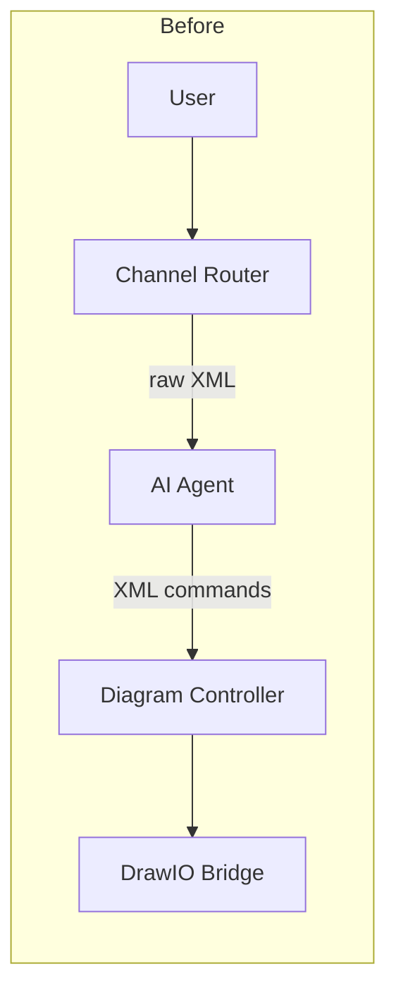
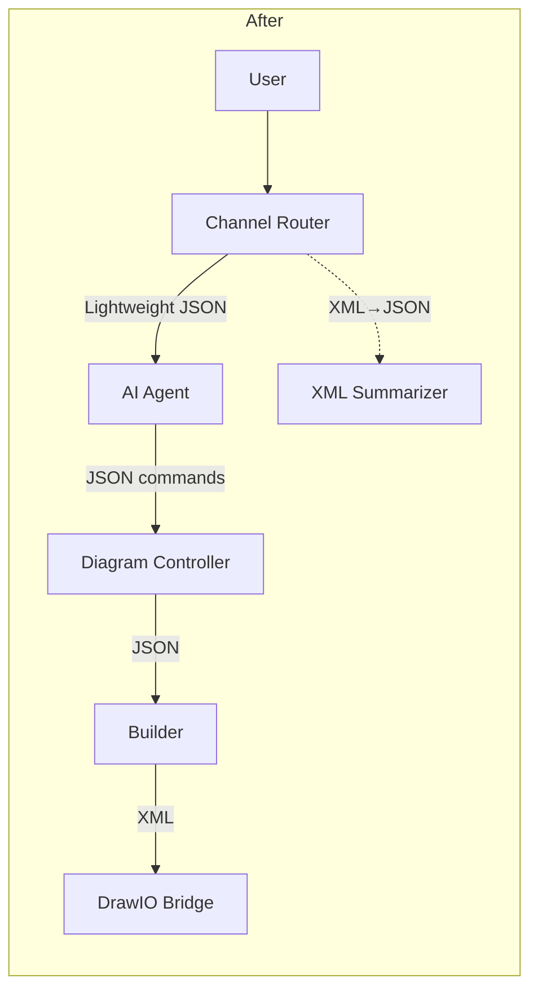
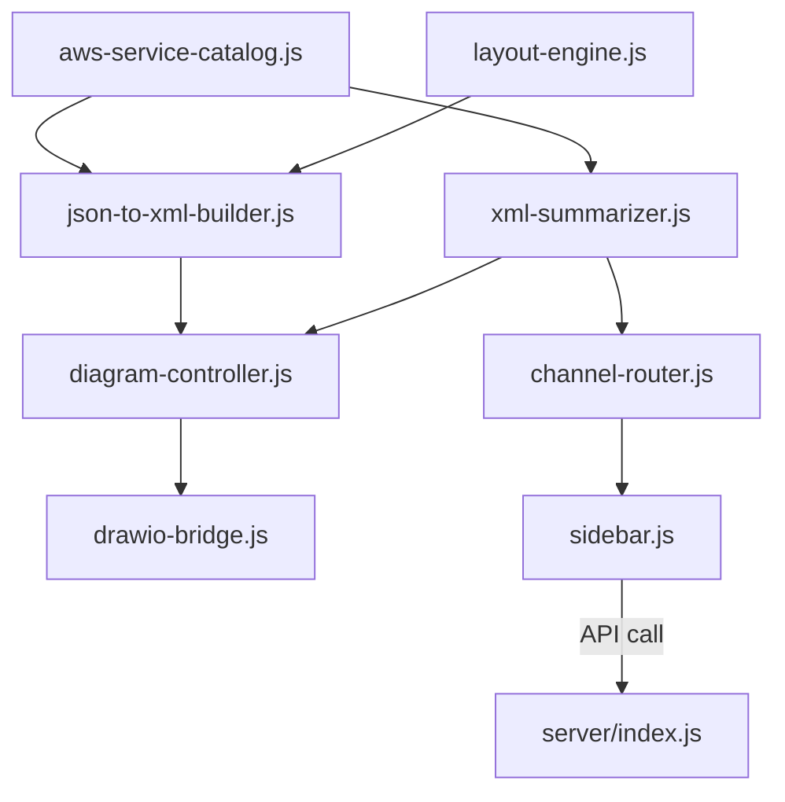

# Design Document: JSON-to-XML Builder

## Overview

DaVinci 앱의 현재 아키텍처에서 AI Agent(Bedrock Claude)는 drawio XML을 직접 읽고 생성한다. 이 방식은 토큰 소비가 크고, XML 문법 오류에 취약하며, 좌표 계산을 AI에게 위임하는 비효율이 있다.

본 설계는 AI와 다이어그램 사이에 **JSON-to-XML Builder 레이어**를 도입하여:
1. AI는 경량 JSON(Lightweight_JSON)만 입출력
2. Builder가 JSON → drawio XML 변환 담당
3. XML Summarizer가 drawio XML → JSON 역변환 담당
4. Layout Engine이 좌표를 자동 계산
5. Service Catalog가 스타일/아이콘을 중앙 관리

이를 통해 AI 토큰 사용량을 대폭 줄이고, XML 문법 오류를 원천 차단하며, 일관된 다이어그램 스타일을 보장한다.

### 변경 전후 데이터 흐름





## Architecture

### 모듈 구조



### 핵심 설계 결정

1. **Builder를 순수 함수로 구현**: `buildXml(lightweightJson) → string` 형태의 순수 함수로 구현하여 테스트 용이성을 확보한다. DOM 의존 없이 문자열 조합으로 XML을 생성한다.

2. **Layout Engine 분리**: 좌표 계산 로직을 Builder와 분리하여 단일 책임 원칙을 준수한다. Layout Engine은 Lightweight_JSON을 받아 각 요소에 좌표를 부여한 enriched JSON을 반환한다.

3. **XML Summarizer는 DOMParser 사용**: 브라우저 환경의 DOMParser를 활용하여 XML을 파싱한다. 기존 `aws-analyzer.js`의 파싱 패턴을 재활용한다.

4. **Service Catalog 확장 (기존 모듈 수정)**: 새 모듈을 만들지 않고 기존 `aws-service-catalog.js`에 `getServiceStyle(type)`, `getGroupStyle(type)`, `getServiceDimensions(type)` 함수를 추가한다.

5. **하위 호환성 유지**: `replace_all` 커맨드에서 기존 `xml` 필드와 새 `architecture` 필드를 모두 지원한다.

## Components and Interfaces

### 1. Service Catalog 확장 (`src/core/aws-service-catalog.js`)

기존 모듈에 다음 함수를 추가:

```javascript
/**
 * 서비스 타입에 대한 완전한 drawio mxCell 스타일 문자열 반환
 * @param {string} type - 서비스 타입 (예: 'ec2', 'lambda')
 * @returns {string|null} drawio 스타일 문자열, 미등록 시 null
 */
export function getServiceStyle(type) { ... }

/**
 * 그룹 타입에 대한 drawio 컨테이너 스타일 문자열 반환
 * @param {string} type - 그룹 타입 ('vpc', 'subnet_public', 'subnet_private', 'az', 'asg', 'aws_cloud')
 * @returns {string|null} drawio 컨테이너 스타일 문자열, 미등록 시 null
 */
export function getGroupStyle(type) { ... }

/**
 * 서비스 타입의 기본 아이콘 크기 반환
 * @param {string} type - 서비스 타입
 * @returns {{width: number, height: number}|null}
 */
export function getServiceDimensions(type) { ... }
```

### 2. Layout Engine (`src/core/layout-engine.js`)

```javascript
/**
 * Lightweight_JSON의 그룹/서비스 구조를 분석하여 좌표를 계산한다.
 * @param {LightweightJSON} json - 좌표 없는 Lightweight_JSON
 * @returns {LayoutResult} 각 요소의 id → {x, y, width, height} 매핑
 */
export function calculateLayout(json) { ... }

/**
 * @typedef {Object} LayoutResult
 * @property {Record<string, {x: number, y: number, width: number, height: number}>} positions
 */
```

레이아웃 알고리즘:
- 그룹 계층을 트리로 구성 (aws_cloud > vpc > az > subnet > asg)
- 리프 노드(서비스)부터 bottom-up으로 크기 계산
- 서비스 간 최소 간격 40px, 그룹 내부 패딩 20px, 라벨 영역 30px
- 같은 그룹 내 서비스는 그리드 배치 (행당 최대 4개)
- 그룹에 속하지 않는 서비스는 최상위 레벨에 배치

### 3. JSON-to-XML Builder (`src/core/json-to-xml-builder.js`)

```javascript
/**
 * Lightweight_JSON을 drawio mxGraphModel XML로 변환한다.
 * @param {LightweightJSON} json
 * @returns {string} drawio XML 문자열
 */
export function buildXml(json) { ... }
```

내부 처리 순서:
1. `validateJson(json)` — 스키마 검증, 미등록 타입 경고
2. `calculateLayout(json)` — Layout Engine으로 좌표 계산
3. 그룹 → container mxCell 생성 (Service Catalog에서 스타일 조회)
4. 서비스 → vertex mxCell 생성 (Service Catalog에서 스타일/크기 조회)
5. 연결 → edge mxCell 생성 (기본 엣지 스타일 적용)
6. mxGraphModel XML 래핑

### 4. XML Summarizer (`src/core/xml-summarizer.js`)

```javascript
/**
 * drawio XML을 Lightweight_JSON으로 역변환한다.
 * @param {string} xml - drawio mxGraphModel XML
 * @returns {LightweightJSON}
 */
export function summarizeXml(xml) { ... }
```

내부 처리:
1. DOMParser로 XML 파싱
2. mxCell 순회: container=1 → groups, vertex=1 + AWS 스타일 → services, edge=1 → connections
3. Service Catalog의 `identifyServiceByStyle()`로 서비스 타입 식별
4. parent 속성으로 그룹-서비스 계층 관계 복원

### 5. Diagram Controller 변경 (`src/core/diagram-controller.js`)

기존 `_replaceAll` 메서드 수정:

```javascript
async _replaceAll(params) {
    if (params.architecture) {
        // 새 경로: Lightweight_JSON → Builder → XML
        const xml = buildXml(params.architecture);
        this._bridge.loadXml(xml);
    } else if (params.xml) {
        // 하위 호환: 기존 XML 직접 로드
        this._bridge.loadXml(params.xml);
    } else {
        throw new Error('replace_all: architecture 또는 xml이 필요합니다.');
    }
}
```

`_addService` 메서드 수정:
```javascript
async _addService(params) {
    const currentXml = await this._bridge.getCurrentXml();
    const currentJson = summarizeXml(currentXml);
    // 새 서비스를 JSON에 추가
    currentJson.services.push({
        id: generateId(),
        type: params.serviceType,
        label: params.label || SERVICE_LABELS[params.serviceType],
        group: params.group || undefined,
    });
    const newXml = buildXml(currentJson);
    this._bridge.loadXml(newXml);
}
```

### 6. Channel Router 변경 (`src/core/channel-router.js`)

```javascript
async preparePayload(userMessage) {
    const channel = this._detectChannel(userMessage);
    const xml = await this._bridge.getCurrentXml();

    if (channel === 'xml') {
        // 변경: XML 대신 Lightweight_JSON 전달
        const lightweightJson = summarizeXml(xml);
        return { channel, data: { architecture: lightweightJson } };
    }
    // summary 채널은 기존 유지
    ...
}
```

### 7. Server 시스템 프롬프트 변경 (`server/index.js`)

- `replace_all` 커맨드의 params를 `{ architecture: LightweightJSON }` 형태로 변경
- AI에게 Lightweight_JSON 스키마를 시스템 프롬프트에 포함
- AI가 XML을 직접 생성하지 않도록 명시적 지시 추가
- 현재 아키텍처 컨텍스트를 Lightweight_JSON으로 전달

## Data Models

### Lightweight_JSON 스키마

```typescript
interface LightweightJSON {
    groups: Group[];
    services: Service[];
    connections: Connection[];
}

interface Group {
    id: string;                    // 고유 식별자
    type: GroupType;               // 그룹 타입
    label: string;                 // 표시 라벨
    children: string[];            // 자식 서비스/그룹 id 배열
}

type GroupType = 'vpc' | 'subnet_public' | 'subnet_private' | 'az' | 'asg' | 'aws_cloud';

interface Service {
    id: string;                    // 고유 식별자
    type: string;                  // Service Catalog의 서비스 타입 (예: 'ec2', 'lambda')
    label: string;                 // 표시 라벨
    group?: string;                // 소속 그룹 id (선택)
}

interface Connection {
    from: string;                  // 소스 서비스/그룹 id
    to: string;                    // 타겟 서비스/그룹 id
    label?: string;                // 연결 라벨 (선택)
    style?: string;                // 커스텀 엣지 스타일 (선택, 미지정 시 기본 스타일)
}
```

### Group Style 매핑

| GroupType | drawio shape | strokeColor | fillColor |
|-----------|-------------|-------------|-----------|
| aws_cloud | mxgraph.aws4.group (grIcon=group_aws_cloud_alt) | #232F3E | none |
| vpc | mxgraph.aws4.group (grIcon=group_vpc) | #248814 | none |
| az | 기본 rect (dashed=1) | #147EBA | none |
| subnet_public | mxgraph.aws4.group (grIcon=group_security_group) | #7AA116 | #F2F6E8 |
| subnet_private | mxgraph.aws4.group (grIcon=group_security_group) | #00A4A6 | #E6F6F7 |
| asg | mxgraph.aws4.groupCenter (grIcon=group_auto_scaling_group) | #D86613 | none |

### 기본 Edge 스타일

```
edgeStyle=orthogonalEdgeStyle;rounded=1;orthogonalLoop=1;jettySize=auto;
html=1;strokeColor=#6B7785;strokeWidth=1.5;
```

### Layout Engine 상수

| 상수 | 값 | 설명 |
|------|-----|------|
| SERVICE_ICON_SIZE | 78×78 (기본) | 서비스 아이콘 크기 |
| SERVICE_GAP | 40px | 서비스 간 최소 간격 |
| GROUP_PADDING | 20px | 그룹 내부 패딩 |
| GROUP_LABEL_HEIGHT | 30px | 그룹 라벨 영역 높이 |
| GRID_MAX_COLS | 4 | 그리드 배치 시 행당 최대 서비스 수 |


## Correctness Properties

*A property is a characteristic or behavior that should hold true across all valid executions of a system — essentially, a formal statement about what the system should do. Properties serve as the bridge between human-readable specifications and machine-verifiable correctness guarantees.*

### Property 1: Build-Summarize 라운드트립

*For any* 유효한 Lightweight_JSON 객체에 대해, `buildXml(json)`으로 XML을 생성한 후 `summarizeXml(xml)`로 역변환하면, 원본과 동등한 구조(서비스 타입/라벨, 그룹 타입/라벨/계층, 연결 from/to)를 가진 Lightweight_JSON이 생성되어야 한다.

**Validates: Requirements 5.5, 2.1, 5.1, 5.2, 5.3, 5.4**

### Property 2: mxCell ID 고유성

*For any* 유효한 Lightweight_JSON 객체에 대해, `buildXml(json)`이 생성한 XML 내 모든 mxCell의 id 속성 값은 서로 중복되지 않아야 한다.

**Validates: Requirements 2.7**

### Property 3: 서비스 스타일 정확성

*For any* 유효한 Lightweight_JSON의 서비스에 대해, `buildXml(json)`이 생성한 XML에서 해당 서비스의 mxCell style 속성은 `getServiceStyle(type)`이 반환하는 스타일 문자열을 포함해야 한다.

**Validates: Requirements 2.2, 4.1**

### Property 4: 부모 그룹이 자식을 포함

*For any* 중첩 그룹 구조를 가진 Lightweight_JSON에 대해, Layout Engine이 계산한 부모 그룹의 바운딩 박스(x, y, width, height)는 모든 자식 요소의 바운딩 박스를 완전히 포함해야 한다.

**Validates: Requirements 3.1, 3.2**

### Property 5: 서비스 간 최소 간격

*For any* 같은 그룹에 속한 두 서비스에 대해, Layout Engine이 계산한 좌표에서 두 서비스의 바운딩 박스 사이 간격은 40px 이상이어야 한다.

**Validates: Requirements 3.3**

### Property 6: 그룹 라벨 영역 확보

*For any* 자식 요소를 가진 그룹에 대해, Layout Engine이 계산한 자식 요소의 y 좌표는 그룹 내부 기준 30px 이상이어야 한다 (라벨 영역 확보).

**Validates: Requirements 3.4**

### Property 7: 카탈로그 완전성

*For all* Service Catalog에 등록된 서비스 타입에 대해, `getServiceStyle(type)`은 non-null 스타일 문자열을, `getServiceDimensions(type)`은 양수 width/height를, `getGroupStyle(groupType)`은 모든 유효 그룹 타입에 대해 non-null 스타일 문자열을 반환해야 한다.

**Validates: Requirements 4.1, 4.2, 4.3**

### Property 8: 미등록 타입 null 반환

*For any* Service Catalog에 등록되지 않은 임의의 문자열에 대해, `getServiceStyle(type)`은 null을 반환해야 한다.

**Validates: Requirements 4.4**

### Property 9: 엣지 스타일 적용

*For any* Lightweight_JSON의 연결에 대해, style 필드가 없으면 생성된 edge mxCell은 기본 스타일(orthogonalEdgeStyle, rounded=1, strokeColor=#6B7785, strokeWidth=1.5)을 포함해야 하고, style 필드가 있으면 해당 커스텀 스타일을 포함해야 한다.

**Validates: Requirements 9.1, 9.2**

### Property 10: Channel Router가 수정 의도 시 Lightweight_JSON 전달

*For any* 수정/생성 키워드를 포함하는 메시지에 대해, Channel Router의 payload는 원본 drawio XML이 아닌 Lightweight_JSON 구조(groups, services, connections 필드)를 포함해야 한다.

**Validates: Requirements 6.1, 6.3**

### Property 11: add_service가 기존 서비스 보존

*For any* 기존 다이어그램(N개 서비스)에 새 서비스를 추가할 때, 결과 다이어그램은 기존 N개 서비스를 모두 포함하고 새 서비스 1개가 추가되어 총 N+1개 서비스를 가져야 한다.

**Validates: Requirements 8.3**

## Error Handling

### Builder 오류 처리

| 오류 상황 | 처리 방식 |
|-----------|----------|
| 미등록 서비스 타입 | 기본 제네릭 스타일로 렌더링 + `console.warn()` |
| 존재하지 않는 id 참조 (connection) | 해당 연결 무시 + `console.warn()` |
| 빈 JSON (services/groups 모두 비어있음) | 빈 mxGraphModel XML 반환 |
| null/undefined 입력 | `Error` throw |

### XML Summarizer 오류 처리

| 오류 상황 | 처리 방식 |
|-----------|----------|
| 유효하지 않은 XML | 빈 Lightweight_JSON 반환 (`{groups:[], services:[], connections:[]}`) |
| 인식 불가 서비스 스타일 | type을 `'unknown'`으로 설정 |
| 빈 XML 문자열 | 빈 Lightweight_JSON 반환 |

### Diagram Controller 오류 처리

| 오류 상황 | 처리 방식 |
|-----------|----------|
| Builder XML 변환 실패 | 스냅샷에서 롤백 + Toast 오류 메시지 |
| XML Summarizer 실패 | 기존 XML 유지 + Toast 경고 메시지 |

## Testing Strategy

### 테스트 프레임워크

- **Unit/Property Test Runner**: Vitest (기존 프로젝트 설정 활용)
- **Property-Based Testing Library**: fast-check (이미 devDependencies에 포함)
- **환경**: jsdom (vite.config.js에 설정됨)

### Property-Based Tests

각 Correctness Property에 대해 하나의 property-based test를 작성한다. 최소 100회 반복 실행.

테스트 파일 구조:
```
src/core/__tests__/
  json-to-xml-builder.property.test.js    — Property 1, 2, 3, 9
  layout-engine.property.test.js          — Property 4, 5, 6
  service-catalog-extended.property.test.js — Property 7, 8
  channel-router-json.property.test.js    — Property 10
  diagram-controller-json.property.test.js — Property 11
```

각 테스트는 다음 태그 형식의 주석을 포함해야 한다:
```
Feature: json-to-xml-builder, Property {number}: {property_text}
```

### Generators (fast-check)

테스트에 필요한 주요 Arbitrary 생성기:

1. **arbLightweightJSON**: 유효한 Lightweight_JSON 객체 생성
   - 등록된 서비스 타입에서 랜덤 선택
   - 유효한 그룹 타입에서 랜덤 선택
   - 서비스-그룹 관계 일관성 보장
   - 연결의 from/to가 실제 존재하는 서비스 id 참조

2. **arbServiceType**: Service Catalog에 등록된 서비스 타입 중 랜덤 선택

3. **arbGroupType**: 유효한 그룹 타입 중 랜덤 선택

4. **arbUnknownType**: Service Catalog에 등록되지 않은 임의 문자열 생성

5. **arbNestedGroups**: 중첩 그룹 구조 생성 (aws_cloud > vpc > az > subnet)

### Unit Tests

Property test로 커버되지 않는 영역:

- **Edge cases**: 빈 JSON, null 입력, 빈 XML, 파싱 오류 XML
- **Integration**: Diagram Controller의 replace_all 하위 호환성 (xml 필드)
- **Integration**: Diagram Controller의 롤백 동작
- **Server**: 시스템 프롬프트에 Lightweight_JSON 스키마 포함 여부
- **Channel Router**: summary 채널 기존 동작 유지

### 테스트 실행

```bash
npm run test
```

Vitest는 `--run` 플래그로 단일 실행 모드로 동작 (package.json에 이미 설정됨).
