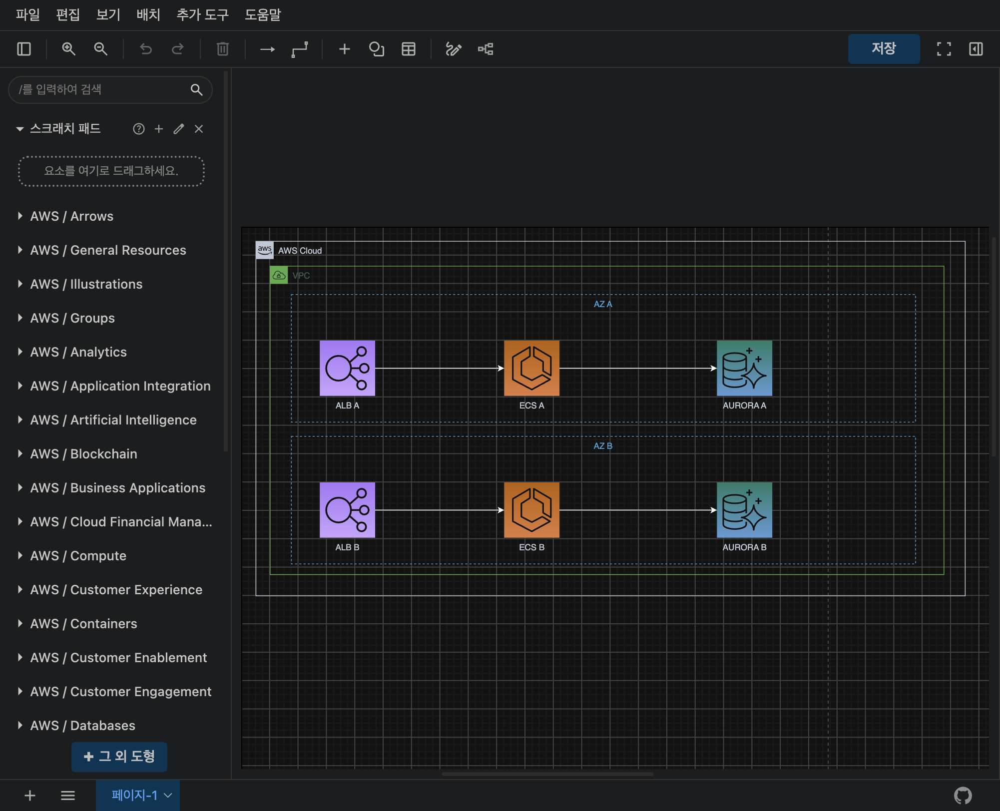
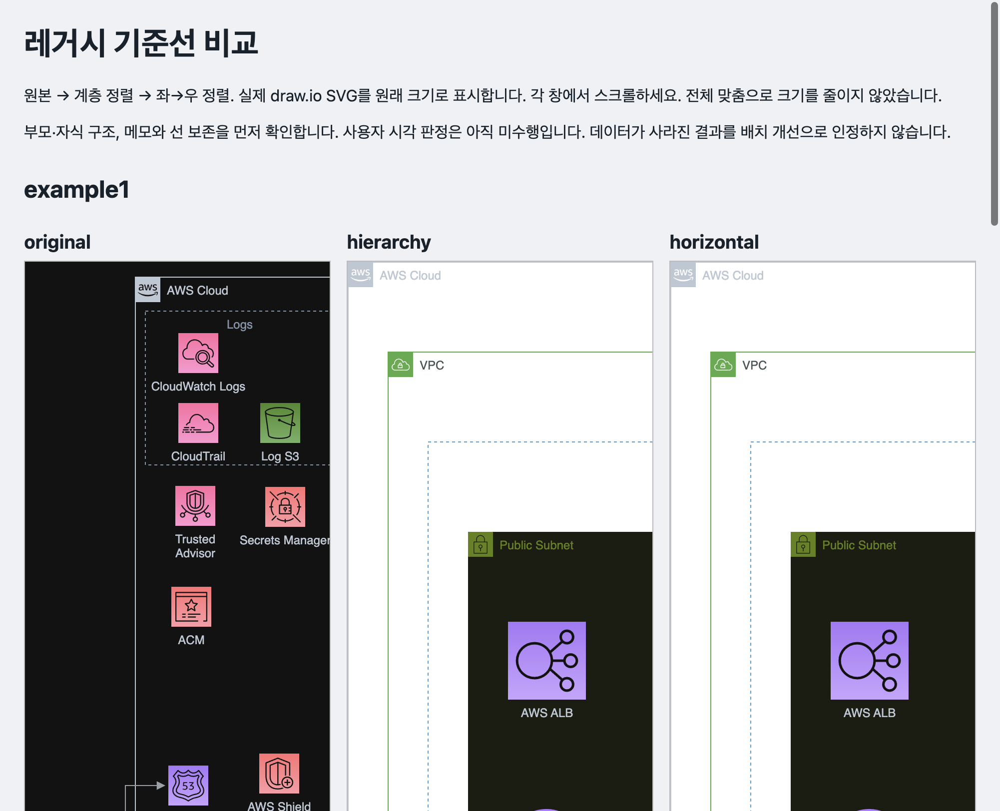

# DaVinci

DaVinci는 **앱을 이루는 부품과 그 연결을 그린 "지도"(아키텍처 그림)**를 고치는 웹 도구입니다.
이미 가진 draw.io 그림을 열고, "로그 보관용 S3 추가해줘"처럼 말로 부탁하면 AI가 그림에 부품을 넣어 줍니다.
핵심 목표는 하나입니다. **원래 그림을 망가뜨리지 않고, 새 부품을 원래 그림에 어울리게 끼워 넣는 것.**

## 용어 먼저

- **AWS**: 아마존이 빌려주는 클라우드 서비스 모음입니다. 내 컴퓨터가 아니라 인터넷 너머의 컴퓨터를 씁니다.
- **S3**: 파일 보관함입니다.
- **EC2**: 빌려 쓰는 컴퓨터입니다.
- **RDS**: 데이터베이스(정보를 정리해 두는 서랍장)입니다.
- **Lambda**: 필요할 때만 실행되는 작은 프로그램입니다.

## 그림은 이렇게 생겼어요



*2026-10-06 기준선 측정 때 draw.io에서 연 공개용으로 검사를 위해 만든 예시 그림입니다(회사 실제 그림이 아닙니다).
두 줄의 아이콘·그룹·연결을 유지하는지 보는 입력이며, 최신 서비스 추가 결과가 아닙니다.
네모난 **아이콘이 부품**이고 **화살표가 부품 사이의 연결**입니다.*

## 무엇을 해 주나요

기존 그림에 S3 같은 서비스를 추가할 때 이렇게 동작합니다.

- 기존 아이콘, 고유번호(ID), 메모, 라벨, 연결선, 다른 페이지는 각각 그대로 둡니다.
- 같은 서비스가 이미 있으면 그 스타일·크기·소속 그룹을 참고하고, 같은 줄에 공간이 있으면 그 줄 안에 끼워 넣습니다.
  이때 그 줄의 아이콘 몇 개가 옆으로 조금 움직일 수 있습니다.
- 새 아이콘이 다른 아이콘과 겹치지 않는지 확인합니다(그룹 틀 안에 들어가는 것은 오류가 아닙니다). 자리가 부족하면 기존 방식으로 빈자리에 놓습니다.

## 기준선과 합격 기준

**기준선**은 고치기 전에 같은 그림으로 남겨 둔 성적표입니다. 고친 뒤 같은 방법으로 재서 나아졌는지 비교합니다.
처음 도구는 그림을 정리하다가 부품과 연결을 잃어버리는 문제가 있었습니다.



*2026-10-06 비교 화면입니다. 왼쪽이 원본, 가운데가 계층 정렬, 오른쪽이 좌→우 정렬입니다.
각 창은 일부분만 보여 주며 전체 판정은 [측정표](development/results/2026-10-06-baseline-v2/table.md)를 보세요.
초기의 실패 결과이고 현재 합격 스크린샷이 아닙니다.*

합격하려면 아래를 모두 지켜야 합니다.

| 지켜야 할 것 | 뜻 |
|---|---|
| 기존 것 유지 | 부품 고유번호(ID)·메모·그룹·연결·다른 페이지가 그대로 |
| 관련 줄만 이동 | 새 아이콘이 들어가는 줄의 아이콘만 움직여도 됨 |
| 참고해서 만들기 | 참고할 같은 서비스가 있을 때 그 스타일·크기·그룹을 따라감 (없어서 빈자리에 놓는 fallback도 합격 가능) |
| 겹침 0 | 새 아이콘 영역이 다른 아이콘과 겹치지 않음 (선·글자 겹침은 아직 안 잼) |

초기 기록의 예: example1은 연결선이 29개였는데 정렬 뒤 2개만 남았습니다
([측정표](development/results/2026-10-06-baseline-v2/table.md)).
초기 KB 그림의 서비스 추가도 보존 검사를 통과하지 못했습니다
([KB 기준선](development/results/2026-10-07-kb-baseline/README.md)).
이 초기 기록과 아래 최신 검사는 입력이 달라서 같은 성능끼리의 비교로 읽으면 안 됩니다.

## 실행하기 (Docker)

준비물: Docker(설치 후 실행 중), Python 3, AWS CLI.

```bash
docker compose up -d --build
```

브라우저에서 <http://localhost:8080> 을 엽니다. 인증을 따로 연결하지 않았다면 **화면만** 쓸 수 있고 AI는 동작하지 않습니다.
(실행 환경에 AWS 인증 환경변수가 이미 있으면 AI도 동작합니다.)

AI까지 쓰려면 AWS CLI의 `default` 프로필에 Amazon Bedrock 사용 권한을 준비한 뒤 실행합니다.
자격 증명 값을 파일에 적을 필요는 없습니다.

```bash
python3 development/tools/start-docker-with-default-aws.py
```

- 기본 모델은 `global.anthropic.claude-sonnet-5-5`이고 생각의 깊이(effort)는 `medium`, 즉 보통 정도입니다.
- AI 요청은 AWS를 실제로 호출하므로 **사용 요금이 생길 수 있습니다.**

## 사용 순서

1. **그림 열기**로 `.drawio` 파일을 엽니다.
2. 고칠 페이지를 고릅니다.
3. 채팅창에 `로그 보관용 S3 추가해줘`처럼 적습니다.
4. 그림에서 새 아이콘을 확인하고, 마음에 들면 **다운로드**합니다.

## 개발자용 실행

먼저 프로젝트 루트의 `.env`에 환경변수를 준비합니다.

```
AWS_REGION=us-east-1
BEDROCK_MODEL_ID=global.anthropic.claude-sonnet-5-5
ALLOWED_ORIGINS=http://localhost:5173
```

AWS 자격 증명은 환경변수나 로컬 AWS 프로필에서 읽습니다. 키를 저장소 파일에 넣지 마세요.

```bash
npm install
npm run dev
```

화면은 <http://localhost:5173>, 서버는 3001번 포트입니다.

```bash
npm test         # 테스트
npm run build    # 빌드
```

## 어디까지 확인했나요

확인한 것:

- 2026-10-08 검사 결과, 테스트 17개 파일 225개와 빌드가 통과했습니다.
- 실제 KB 그림 7페이지에 S3·EC2·RDS·Lambda를 각각 추가한 **28건**을 검사했습니다(2026-10-08).
  그림 파일의 내용과 편집 코드를 컴퓨터에서 자동으로 검사한 **보존 검사**이고, 28건을 브라우저로 눈으로 본 것은 아닙니다.
  기존 아이콘·ID·메모·연결선·다른 페이지 유지와 새 아이콘 겹침 0을 확인했습니다.
- EC2·Lambda처럼 "같은 서비스가 있는 줄에 끼워 넣기"는 검사용 예시 그림(합성 시험)으로만 확인했습니다.

아직 안 한 것:

- 선이 서로 교차하거나 글자(라벨)가 겹치는 정도를 재는 자동 지표는 없습니다.
- 자동 정렬 기능은 "원래 그림 보존"이 검증되지 않아 꺼 두었습니다.
- 기존 그림을 참고해 **새 아키텍처를 처음부터 만드는 품질**은 검증하지 않았습니다.
- 2026-10-08 확인 당시, 최신 수정(RDS 표기 인식 등)은 돌고 있던 Docker에 아직 반영되지 않았습니다.

## 더 보기

- 개발 기록: [development/README.md](development/README.md), [backlog](development/backlog.md)
- 최신 검증 상세: [multiservice 결과](development/results/2026-10-08-multiservice/README.md)
